# Hardware development SLS board for Xiaomi Gateway

The board was developed for RF-star CC2652P modules. The program EasyEDA was used. A full description will be after assembly and verification. All description will be in Russian. 

[Development and verification process here](development.md)

[Development and verification Power&LED board](power_led.md)

---

# Разработка платы SLS для шлюзов Xiaomi

Пришел к разработке собственной платы для SLS шлюза. Так как заказывать платы из России стало не удобно и хочется добавить что-то свое. Плата подходит для шлюзов Xiaomi, а за счет добавления прорези под еще одну защелку, подходит и к другим шлюзам Aqara и Xiaomi, где одна защелка смещена. Иногда требуется небольшая модификация корпуса шлюза типа удаления штырьков, которые упираются в плату или тоннеля датчика света. Все подгоняется по месту. 

Сегодня плата SLS может работать как со штатной платой питания шлюза и светодиодами, так и отдельно. Для отдельной работы есть варианты корпусов для печати на 3D принтере. На плату добавлен один адресный диод для индикации работы шлюза в режиме авто, либо можно управлять диодом отдельно задавая свои эффекты. Позже будет в разработке кольцо с адресными диодами для установки вместо штатной платы питания шлюза. В таком исполнении еще понадобится блок питания для подключения шлюза в розетку.

Плата разрабатывалась с нуля под модули RF-star CC2652P. Использовалась программа EasyEDA. Полное описание будет после сборки и проверки в работе. Все описание будет на русском языке. Плата будет доступна к продаже в Украине для любителей самостоятельной сборки.

[Процесс разработки и проверки тут](development.md)

## Принципиальная схема устройства
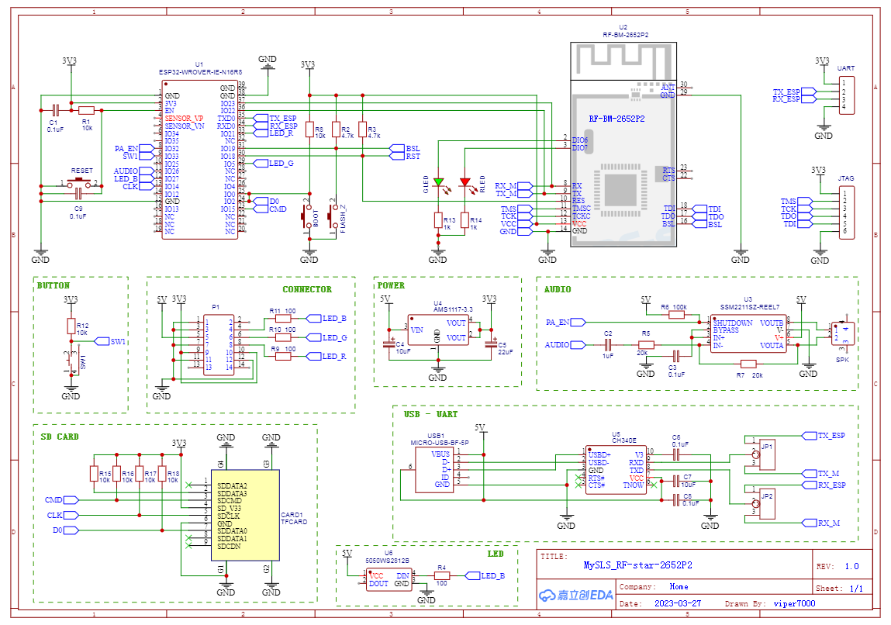

## Собранная плата и разъем для установки в шлюз
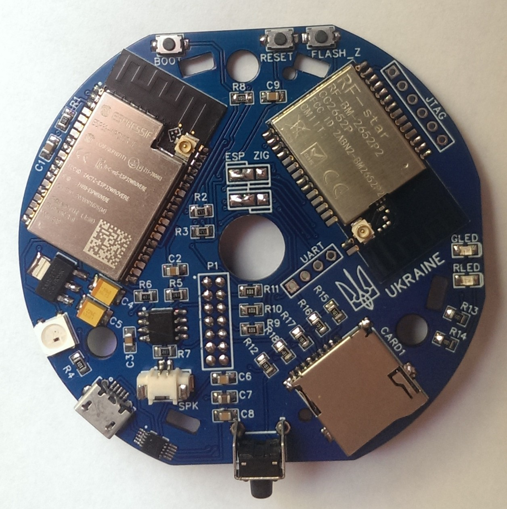 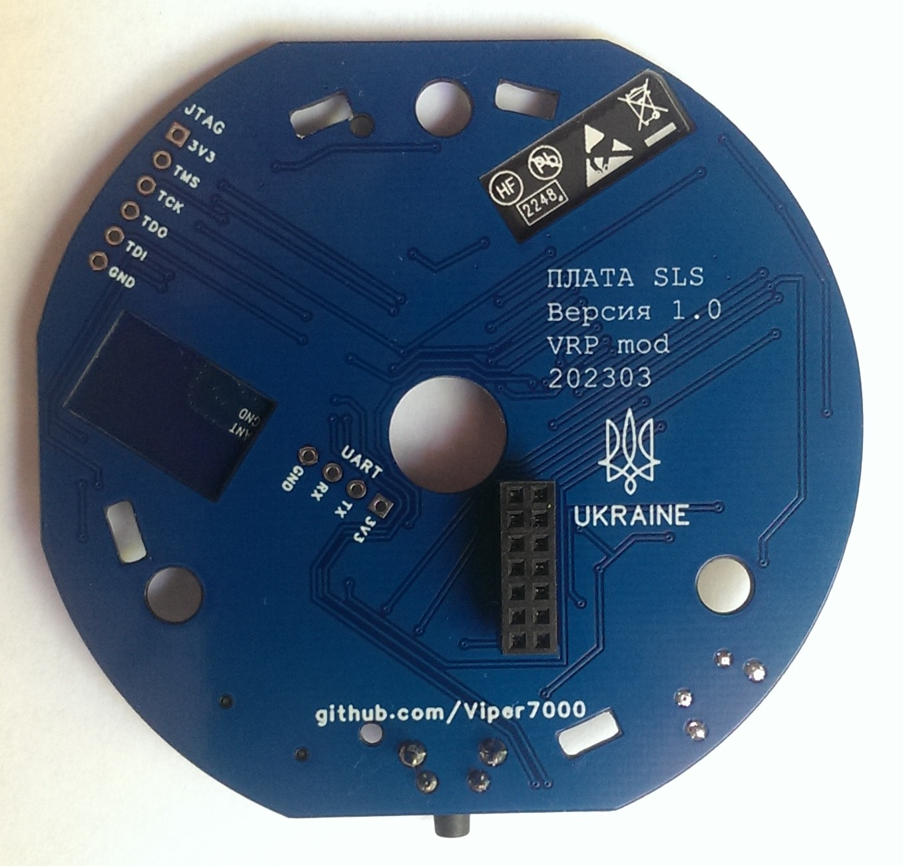

Для использования платы отдельно от шлюза Xiaomi разъем запаивать не нужно. Достать такие разъемы в Украине оказалось не просто, но вроде можно заказать на Али

Для установки нужно укоротить тонель датчика света. У меня Aqara M1S. Такая доработка нужна еще для некоторых шлюзов Xiaomi. Еще удалил один маленький направляющий штырек, который упирался в ESP32.
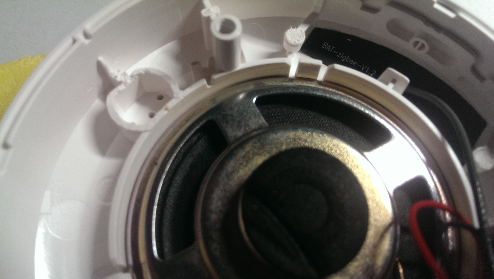

## Разработка платы питания вместо штатной

[Процесс разработки и проверки платы питания и светодиодов](power_led.md)

Была разработана плата питания для замены штатной платы шлюзов Xiaomi и Aqara, для того, чтобы установить на нее адресные диоды на штатные места. Только в штатных местах свет диодов попадает на отражатель и проходит через рассеиватель. Получаем мягкий и смазанный свет. Никаких видимых точек! Даже если светится один светодиод - получаем плавный перелив света по всему кольцу. Дальше будет видео работы световых эффектов.

Блок питания 5В 2А, что был у меня в наличии подходит с запасом. Но он выше свободного места. Придется прорезать плату и устанавливать блок питания через нее. Вышло вот так. 

## Внешний вид готовой и собранной платы
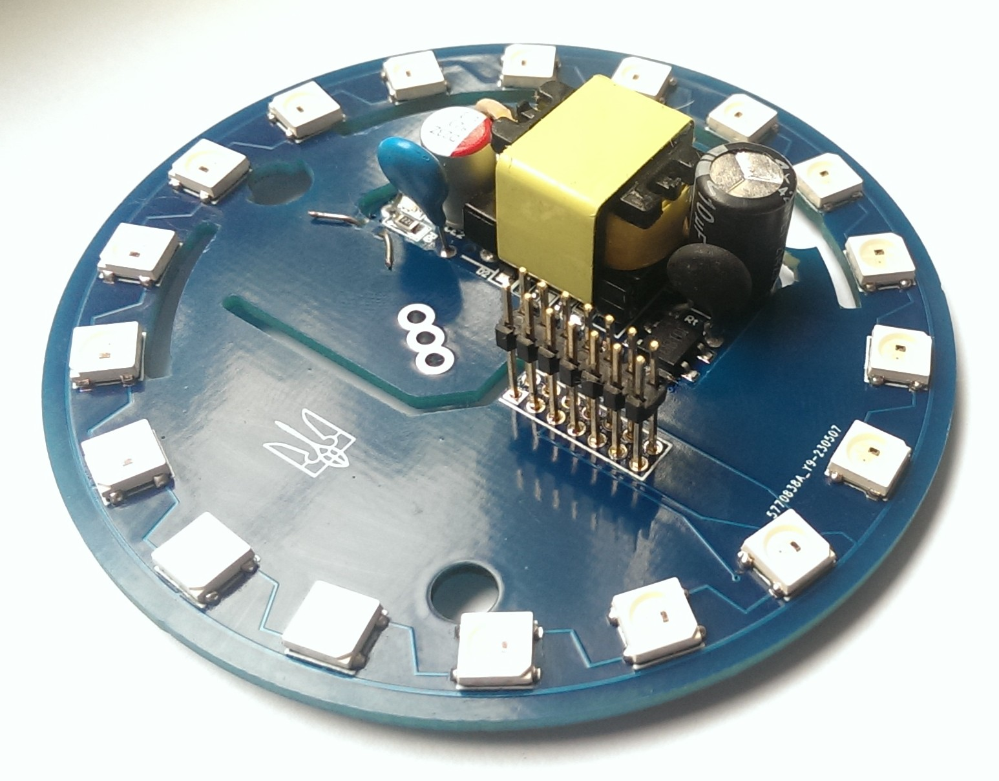 

Для окончательно сборки подключил БП к платному переходу с помощью проводов. Для подключения к сети 220 из кусочков медной фольги сделал две полу трубки и одел на штыри питания 220В. Припаялся проводами. Вот что вышло.

## Установка платы питания
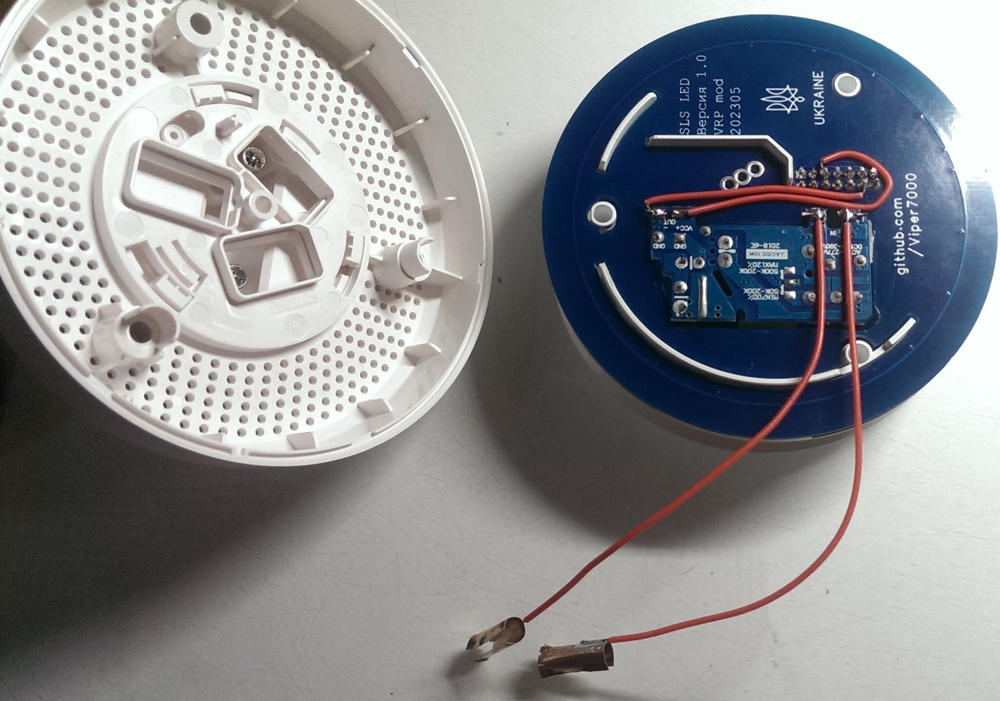
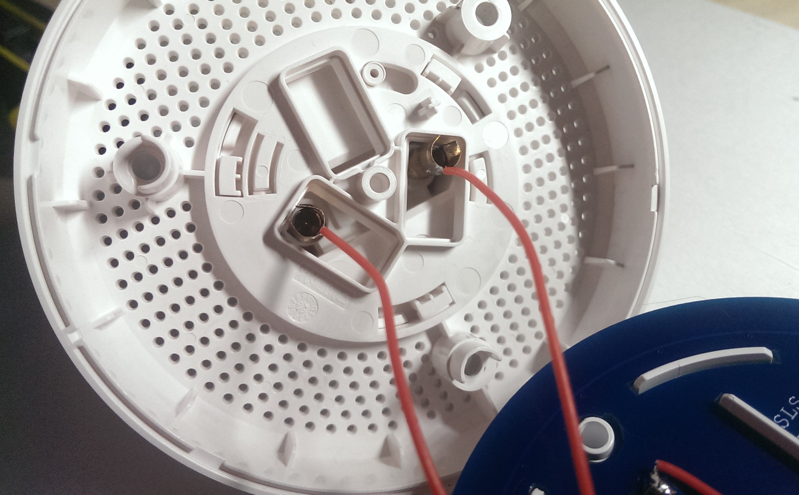
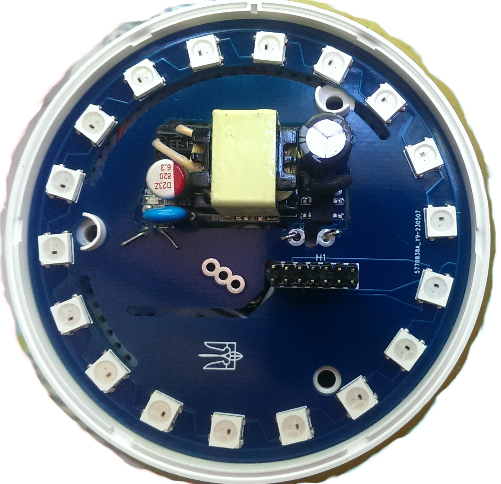

В собранном виде не отличается от штатного шлюза.

## Настройки
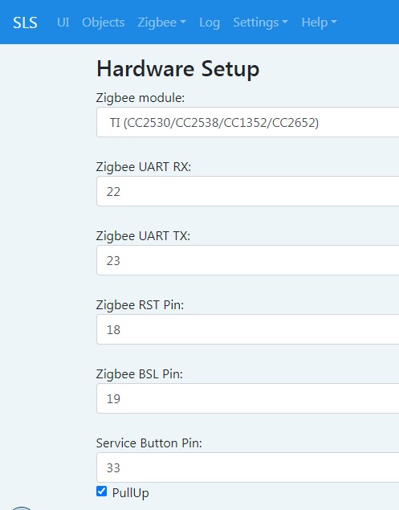 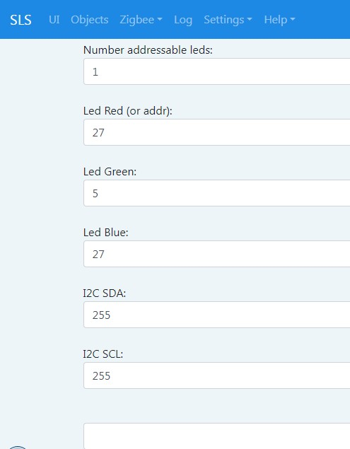

## Внешний вид
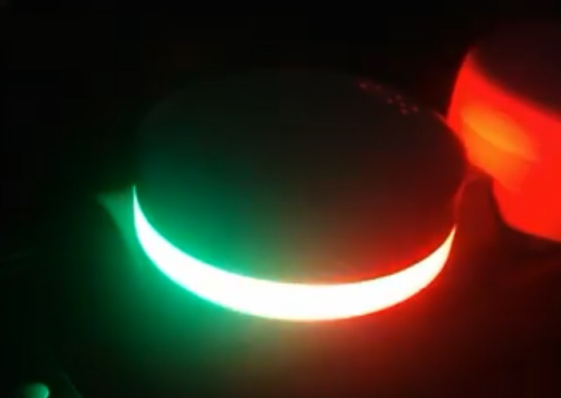
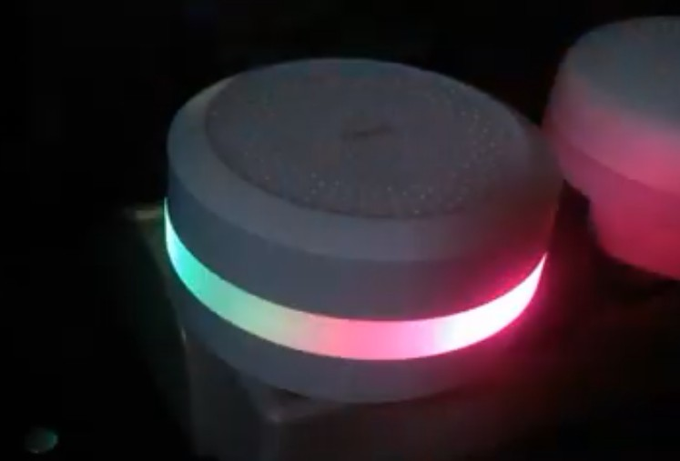

## Видео работы света
<a target=blank href="https://youtu.be/n97AixJyFCw">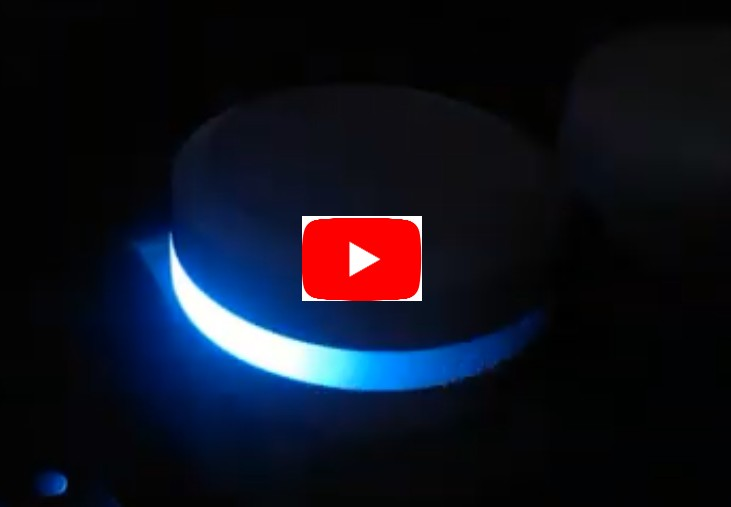</a>

---
Материалы для изучения:
* [SLS Github](https://github.com/slsys/Gateway)
* [SLS Сообщество](https://t.me/slsys)
