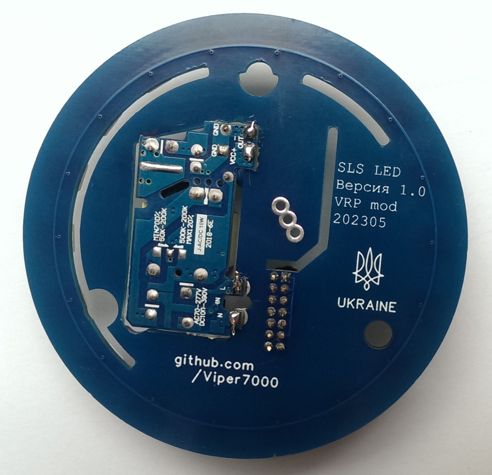

# Hardware development SLS board for Xiaomi Gateway

Came to develop my own board for the SLS gateway. Since ordering boards from Russia has become inconvenient and I want to add something of my own. The board is suitable for Xiaomi gateways, and by adding a slot for another latch, it also fits other Aqara and Xiaomi gateways, where one latch is offset. Sometimes a slight modification of the gateway body is required, such as removing the pins that abut against the board or the light sensor tunnel. Everything fits into place.

Today, the SLS board can work both with a standard gateway power board and LEDs or separately. For individual work, there are options for printing on a 3D printer. One addressable diode has been added to the board to indicate the operation of the gateway in auto mode, or you can control the diode separately by setting your own effects. Later, a ring with addressable diodes will be developed for installation instead of the standard gateway power board. In this version, you will still need a power supply to connect the gateway to a power outlet.

The board was developed for RF-star CC2652P modules. The program EasyEDA was used. A complete description is made after assembly and verification in operation. The board will be available for sale in Ukraine for fans of self-assembly.

[Development and verification process here](development.md)

## Schematic diagram of the device

## Assembled board and connector for installation in the gateway
 

To use the board separately from the Xiaomi gateway, the connector does not need to be soldered. It was not easy to get such connectors in Ukraine, but it seems that you can order on Ali

To install, you need to shorten the light sensor tunnel. I have an Aqara M1S. Such modification is needed for some Xiaomi gateways. I also removed one small guide pin that was resting on the ESP32.

For DIYers:
1. [Gerber](production/Gerber_1.0_PCB1_2023-03-31.zip) file for ordering the main board
2. [BOM](production/BOM_Board1_PCB1_2023-03-31.xlsx) details file

## Development of a power board instead of the standard one

[Development and verification Power&LED board](power_led.md)

A power board was developed to replace the standard board of Xiaomi and Aqara gateways, in order to install addressable diodes on it in regular places. Only in regular places the light of the diodes hits the reflector and passes through the diffuser. We get soft and blurry light. No visible dots! Even if one LED is lit, we get a smooth overflow of light throughout the ring. Next will be a video of the lighting effects.

The 5V 2A power supply that I had in stock is suitable with a margin. But it is above free space. I will have to cut through the board and install the power supply through it. It came out like this.

## Appearance of the finished and assembled board
 

For the final assembly, I connected the PSU to a board transition using wires. To connect to the 220 power, I made two semi-tubes from pieces of copper foil and put them on 220V power pins. Soldered with wires. Here's what happened.

## Installing the power board

When assembled, it does not differ from the regular gateway.

## Settings
 

With add. board with LEDs, you need to set the number of diodes in the settings to 18

## Appearance

## Light work video

---
Study materials (in Russian):
* [SLS Github](https://github.com/slsys/Gateway)
* [SLS Community](https://t.me/slsys)
