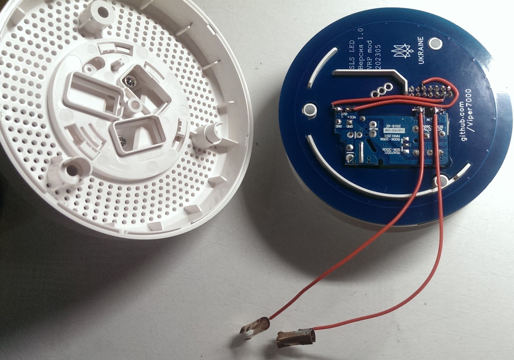
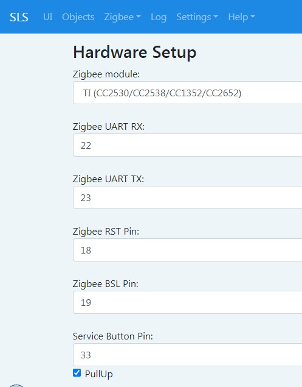
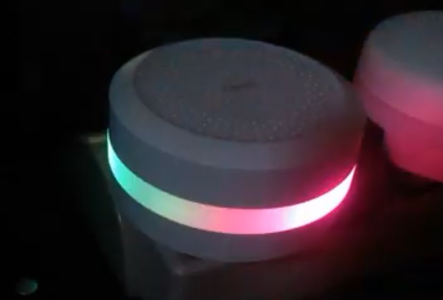

# Розробка плати SLS для шлюзів Xiaomi

Прийшов до розробки власної плати для шлюзу SLS. Тому що замовляти плати із Росії стало не зручно і хочеться додати щось своє. Плата підходить для шлюзів Xiaomi, а за рахунок додавання прорізу під ще одну клямку, підходить і до інших шлюзів Aqara та Xiaomi, де одна клямка зміщена. Іноді потрібна невелика модифікація корпусу шлюзу типу видалення штирьків, які упираються в платню або тунелю датчика світла. Все підганяється за місцем.

Сьогодні плата SLS може працювати як зі штатною платою живлення шлюзу та світлодіодами, так і окремо. Для окремої роботи є варіанти корпусів друку на 3D принтері. На плату додано один адресний діод для індикації роботи шлюзу в режимі авто або можна керувати діодом окремо задаючи свої ефекти. Також розроблене кільце з адресними діодами для встановлення замість штатної плати живлення шлюзу. У такому виконанні ще знадобиться блок живлення для підключення шлюзу до розетки.

Плата розроблялася з нуля під модулі RF-star CC2652P. Використовувалася програма EasyEDA. Повний опис зроблений після збирання та перевірки в роботі. Плата буде доступна для продажу в Україні для любителів самостійного складання.

[Процес розробки та перевірки тут](development_ukr.md)

## Принципова схема пристрою

## Зібрана плата та роз'єм для встановлення в шлюз
 

Для використання плати окремо від шлюзу Xiaomi роз'єм запаювати не потрібно. Дістати такі роз'єми в Україні виявилося не просто, але начебто можна замовити на Алі

Для встановлення потрібно вкоротити тонель датчика світла. У мене Aqara M1S. Таке доопрацювання потрібне ще для деяких шлюзів Xiaomi. Ще видалив один маленький напрямний штир, який упирався в ESP32.

Для любителів самостійного складання:
1. [Гербер](production/Gerber_1.0_PCB1_2023-03-31.zip) файл для замовлення основної плати
2. [BOM](production/BOM_Board1_PCB1_2023-03-31.xlsx) файл деталей 

## Розробка плати живлення замість штатної

[Процес розробки та перевірки плати живлення та світлодіодів](power_led_ukr.md)

Була розроблена плата живлення для заміни штатної плати шлюзів Xiaomi та Aqara, для того щоб встановити на неї адресні діоди на штатні місця. Тільки у штатних місцях світло діодів потрапляє на відбивач і проходить через розсіювач. Отримуємо м'яке та змащене світло. Жодних видимих крапок! Навіть якщо світиться один світлодіод – отримуємо плавний перелив світла по всьому кільцю. Далі буде відео роботи світлових ефектів.

Блок живлення 5В 2А, що був у мене, підходить із запасом. Але він вищий за вільне місце. Потрібно прорізати плату і встановлювати блок живлення крізь неї. Вийшло так.

## Зовнішній вигляд готової та зібраної плати
 

Для остаточного складання підключив БП до платного переходу за допомогою дротів. Для підключення до мережі 220 зі шматочків мідної фольги зробив дві напів трубки і одягнув на штирі живлення 220В. Припаявся проводами. Ось що вийшло.

## Встановлення плати живлення

У зібраному вигляді не відрізняється від штатного шлюзу.

## Налаштування
 

З дод. платою зі світлодіодами потрібно в налаштуваннях поставити кількість діодів 18

## Зовнішній вигляд

## Відео роботи світла

---
Матеріали для вивчення (російською):
* [SLS Github](https://github.com/slsys/Gateway)
* [SLS Сообщество](https://t.me/slsys)
