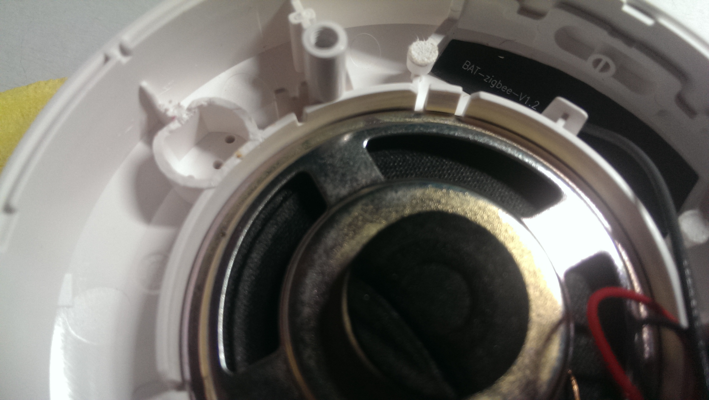

# Плата версии 1.0 в разработке

## Принципиальная схема платы

## Разводка печатной платы
 

## Внешний вид платы
 

 

## Платы полученные с завода

## Собранная плата и разъем для установки в шлюз
 

Для установки нужно укоротить тонель датчика света. У меня Aqara M1S. Такая доработка нужна еще для некоторых шлюзов Xiaomi

## Настройки
 

## Тестирование
Для начальной проверки плата запускалась на столе. Прошивки устанавливались через USB разъем путем запайки перемычек на плате. После прошивки модулей плата запустилась и создала точку доступа. Прописываем настройки WiFi и сохраняем. Первый раз плата запускалась очень долго. Состояние Zigbee - 0. Не работает. Хотя в логах активное общение с Zigbee модулем. Дополнительно стер PDM модуля Zigbee (хотя делал стирание при прошивке). Так же изменил канал и PanID (стандатртный пан на другом шлюзе). Перезапускаем - все работает.
Проверка работы Zigbee CC2652P - устройства подключаются и отвечают. Одно из устройств в дальней комнате. На 2538+2592 сигнал к нему был 10-20 LQI, на модуле 2652 сигнал 80-90 LQI. Отличный результат
Светодиод отрабатывает, эфекты работают.
Перепаял перемычки на плате для подключения по USB к ESP32. Так можно смотреть логи на компьютере
