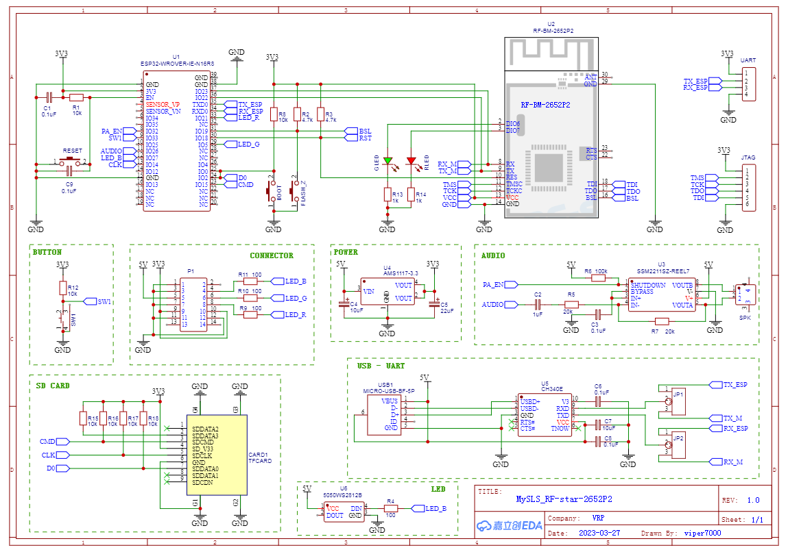
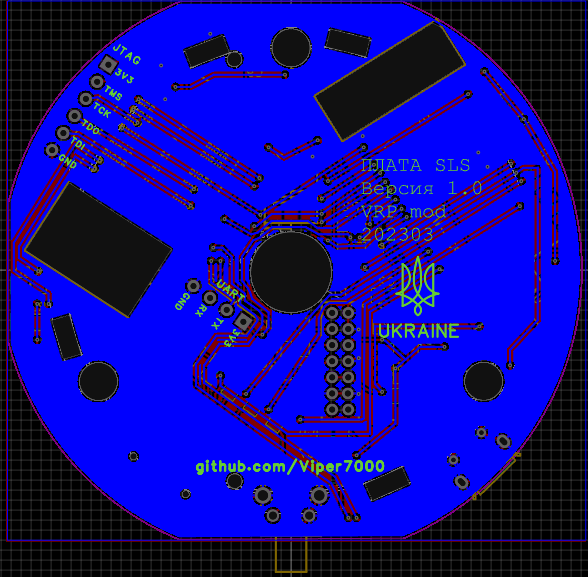
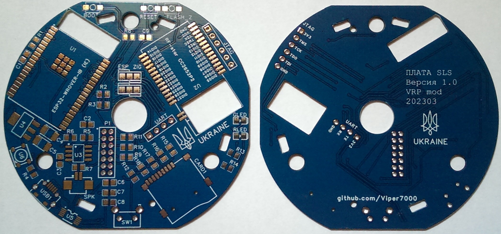
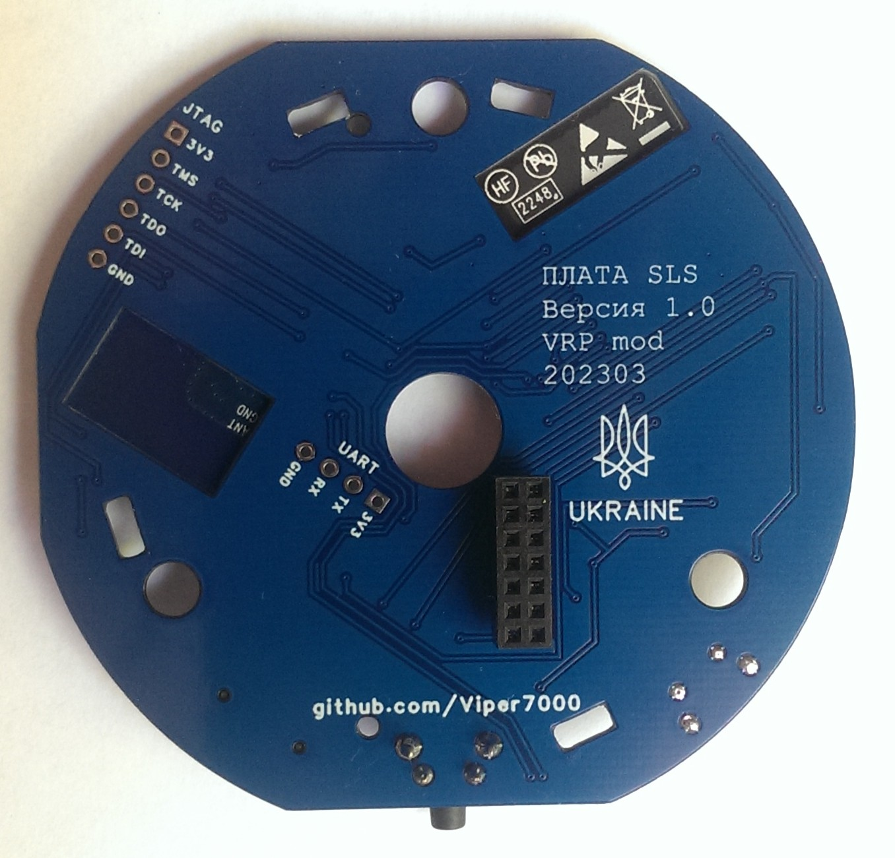
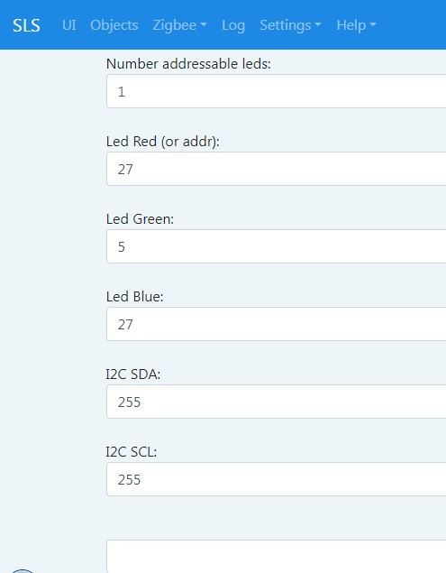

# Плата версії 1.0 у розробці

## Принципова схема плати

## Розведення друкованої плати
 

## Зовнішній вигляд плати
 
 

## Плати отримані із заводу

## Зібрана плата та роз'єм для встановлення в шлюз
 

Для встановлення потрібно вкоротити тонель датчика світла. У мене Aqara M1S. Таке доопрацювання потрібне ще для деяких шлюзів Xiaomi. Ще видалив один маленький напрямний штир, який упирався в ESP32.

## Налаштування
 

## Тестування
Для початкової перевірки плата запускалася на столі. Прошивки встановлювалися через USB роз'єм шляхом запаювання перемичок на платі. Після прошивки модулів плата запустилася та створила точку доступу. Прописуємо налаштування WiFi та зберігаємо. Вперше плата запускалася дуже довго. Стан Zigbee – 0. Не працює. Хоча в логах активне спілкування із Zigbee модулем. Додатково стер PDM модуля Zigbee (хоча робив стирання при прошивці). Також змінив канал і PanID (стандатртний пан на іншому шлюзі). Перезапускаємо – все працює.

Перевірка роботи Zigbee CC2652P - пристрої підключаються та відповідають. Один із пристроїв у дальній кімнаті. На 2538+2592 сигнал був 10-20 LQI, на модулі 2652 сигнал 80-90 LQI. Відмінний результат.

Світлодіод відпрацьовує, ефекти працюють.

Перепаяв перемички на платі для підключення USB до ESP32. Так можна дивитися логи на комп'ютері.

Світлодіоди підключені до Zigbee модуля (зелений та червоний) працюють залежно від прошивки Zigbee модуля. На останній прошивці Koenkk CC1352P2_CC2652P_launchpad_coordinator_20230507.hex працює лише червоний. Інші прошивки не перевіряв.
