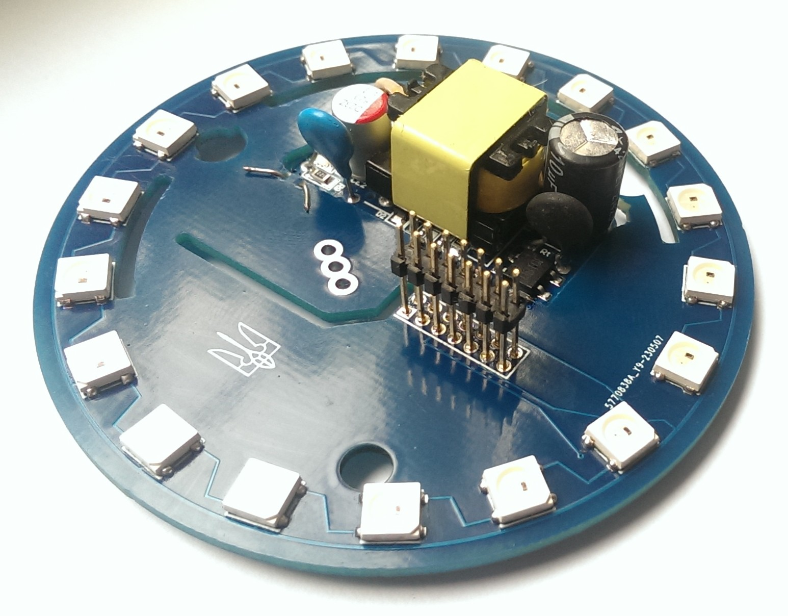

# Плата Power&LED версии 1.0 в разработке

Была разработана плата питания для замены штатной платы шлюзов Xiaomi и Aqara, для того, чтобы установить на нее адрессные диоды на штатные места

## Принципиальная схема платы

## Платы полученные с завода и примерка на штатное место
 

Плата разаработана как макет. Какой будет использован блок питания - не известно. Нужно минимум 5В 700мА
подбор готового блока питания - дело не простое, так как места очень мало. Блок питания 5В 2А, что был у меня в наличии подходит с запасом. Но он выше свободного места. Придется прорезать плату и устанавливать блок питания через нее.

Вышло вот так. Такая плата становится в штатное место. Нужно придумать момент подключения к вилке 220В

## Внешний вид готовой и собранной платы
 

## Тестирование
Плата проверена в работе. БП рабочий и с большим запасом. Диоды работают. Для установки разьема межплатного перехода собирал все на пластмассу шлюза на штатное место, а потом пропаивал разъем. Так он получился точно на свем месте. Теперь осталось собрать все в шлюз
