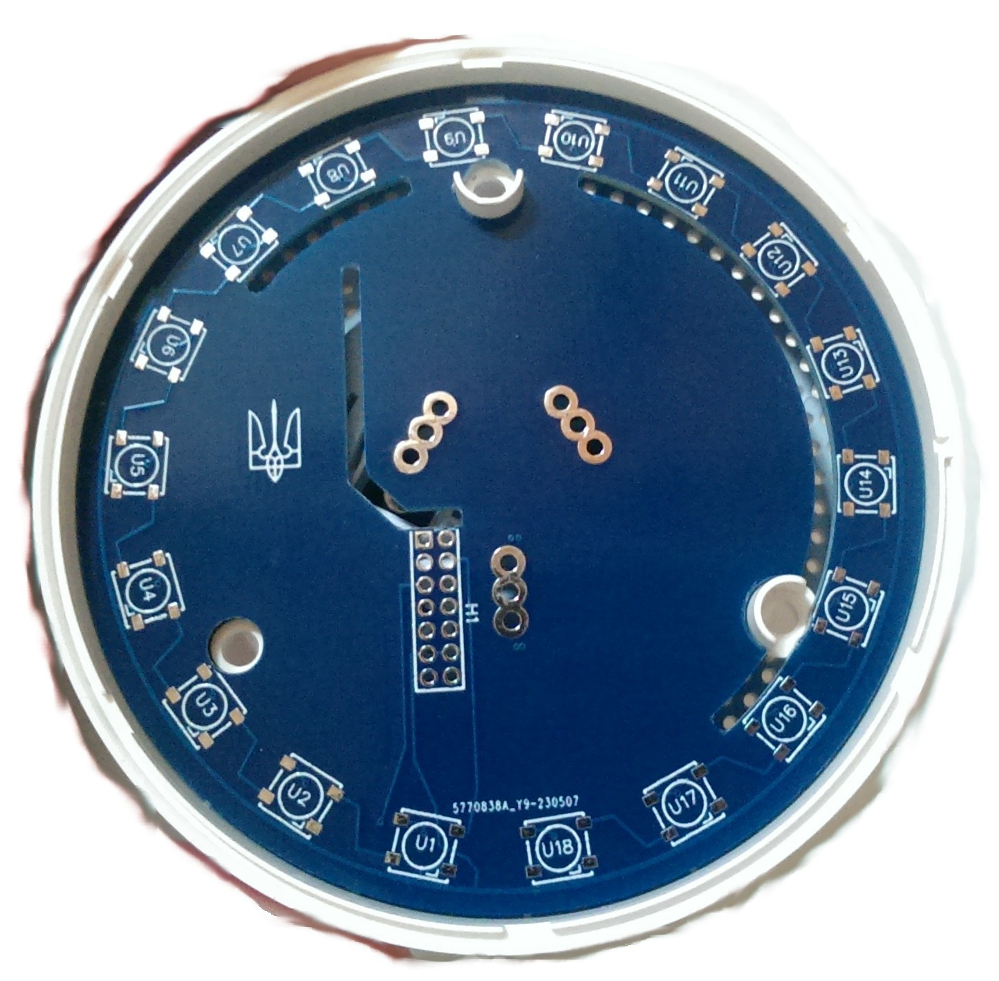
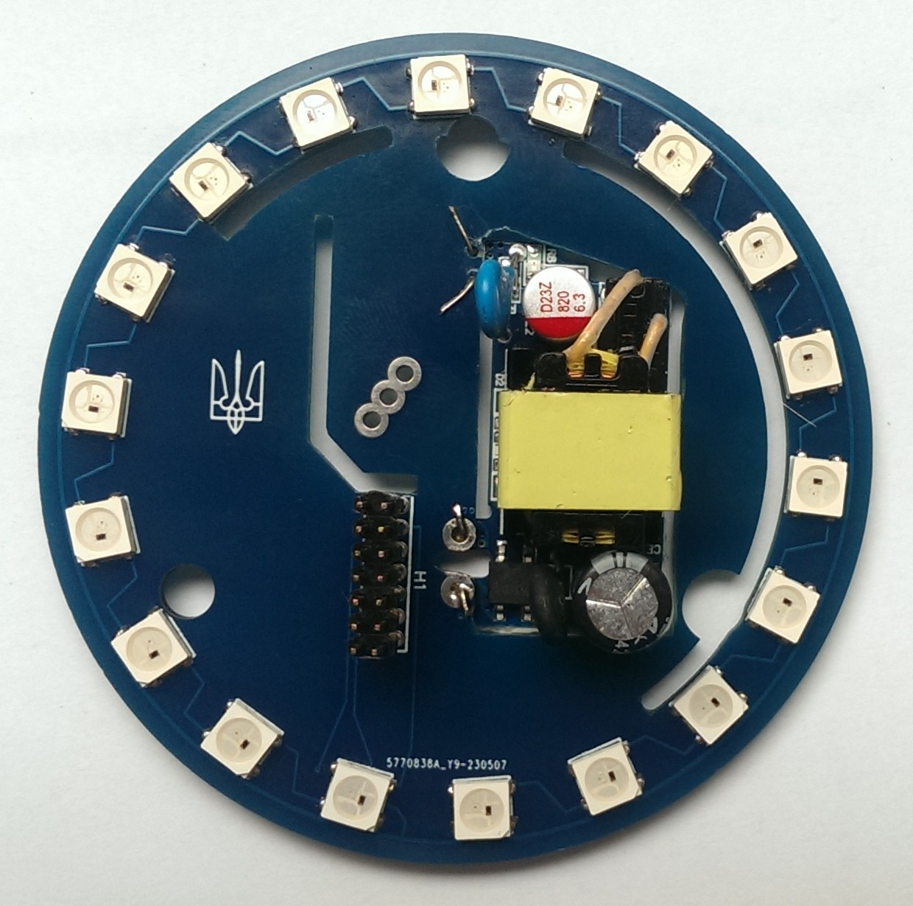

# Плата Power&LED версії 1.0 у розробці

Була розроблена плата живлення для заміни штатної плати шлюзів Xiaomi та Aqara, для того щоб встановити на неї адресні діоди на штатні місця

## Принципова схема плати

## Плати отримані із заводу та примірка на штатне місце
 

Плата розроблена як макет. Який буде використаний блок живлення – не відомо. Потрібно мінімум 5В 700мА.

Підбір готового блоку живлення – справа не проста, тому що місця дуже мало. Блок живлення 5В 2А, що був у мене, підходить із запасом. Але він вищий за вільне місце. Потрібно прорізати плату і встановлювати блок живлення через неї.

Вийшло так. Така плата стає у штатне місце. Потрібно придумати момент підключення до вилки 220В

## Зовнішній вигляд готової та зібраної плати
 

## Тестування
Плата перевірена у роботі. БП процює та з великим запасом. Діоди працюють. Для встановлення роз'єму міжплатного переходу збирав все на пластмасу шлюзу на штатне місце, а потім пропаював роз'єм. Так він вийшов точно на своєму місці. Тепер залишилося зібрати все у шлюз
